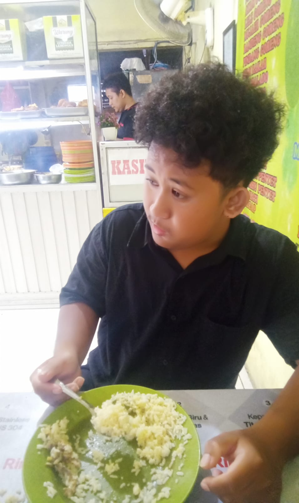

  

  
  
  
  

---

## 📌 About Laravel

Laravel is a web application framework with expressive, elegant syntax. It takes the pain out of development by simplifying common tasks used in many web projects, such as:

- 🔁 [Fast Routing Engine](https://laravel.com/docs/routing)
- 📦 [Powerful Dependency Container](https://laravel.com/docs/container)
- 🧠 [Intuitive Eloquent ORM](https://laravel.com/docs/eloquent)
- 🧱 [Database Migrations](https://laravel.com/docs/migrations)
- 🎯 [Job Queues & Events](https://laravel.com/docs/queues)

Laravel is accessible, powerful, and delivers the tools required to build modern, robust web applications.

---

## 🚀 Learning Laravel

Laravel offers the most comprehensive [documentation](https://laravel.com/docs) and high-quality video tutorials. You can get started with:

- 🔰 [Laravel Bootcamp](https://bootcamp.laravel.com)
- 🎥 [Laracasts](https://laracasts.com)

---

## 🤝 Laravel Sponsors

Thanks to our sponsors for funding Laravel development. Interested in becoming a sponsor? Visit the [Laravel Partners Program](https://partners.laravel.com).

### Premium Partners

- [Vehikl](https://vehikl.com)
- [Tighten Co.](https://tighten.co)
- [WebReinvent](https://webreinvent.com)
- [Kirschbaum Development Group](https://kirschbaumdevelopment.com)
- [64 Robots](https://64robots.com)
- [Curotec](https://www.curotec.com/services/technologies/laravel)
- [Cyber-Duck](https://cyber-duck.co.uk)
- [DevSquad](https://devsquad.com/hire-laravel-developers)
- [Jump24](https://jump24.co.uk)
- [Redberry](https://redberry.international/laravel/)
- [Active Logic](https://activelogic.com)
- [byte5](https://byte5.de)
- [OP.GG](https://op.gg)

---

## 🛠 Contributing

Thank you for considering contributing! Please read the [contribution guide](https://laravel.com/docs/contributions).

## 🧾 License

Laravel is open-sourced software licensed under the [MIT license](https://opensource.org/licenses/MIT).

---

## 👥 Team Behind This Project

  
  

  <em>Our Developers - Passionate, Dedicated, and Ready to Code!</em>

